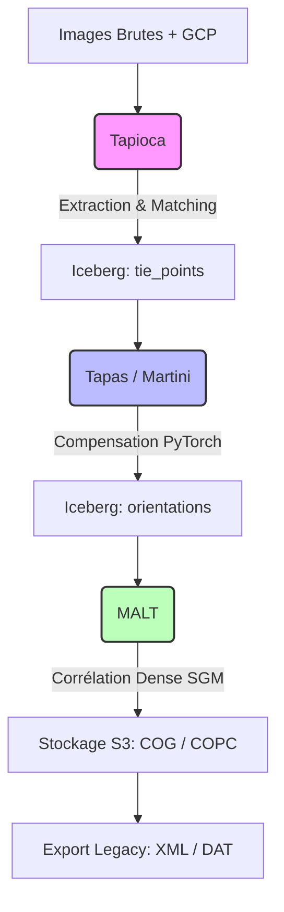

# Architecture de PyMicMac

Ce document présente les diagrammes fonctionnels et techniques de la nouvelle architecture Cloud-Native de MicMac.

## 1. Diagramme Fonctionnel

Le flux de travail suit la logique historique de MicMac (Tapioca -> Tapas -> Malt) mais avec des échanges de données via un entrepôt de données tabulaire (Iceberg) et un stockage objet (S3).



## 2. Diagramme Technique (Infrastructure)

L'architecture repose sur **Ray** pour l'orchestration distribuée et **PyTorch** pour le calcul géométrique. L'infrastructure est déployée sur Kubernetes (GKE ou OVH Cloud).

```mermaid
graph LR
    subgraph "Cluster Ray (GKE / OVH / K8s)"
        WM[Workflow Manager]
        WM --> TP[Tapioca Workers<br/>(CPU/GPU)]
        WM --> TS[Tapas Solver<br/>(GPU Autograd)]
        WM --> MW[Malt Workers<br/>(CPU/GPU)]
    end

    subgraph "Couche de Stockage"
        S3[(MinIO / Ceph / GCS)]
        S3 -.->|Images| TP
        TP -.->|Parquet| IB[[Iceberg Warehouse]]
        IB -.->|Tie-Points| TS
        TS -.->|Orientations| IB
        IB -.->|Calib/Poses| MW
        MW -.->|COG/COPC| S3
    end

    subgraph "Interfaces"
        CLI[CLI / Dashboard]
        GIS[QGIS / STAC / Potree]
        CLI --> WM
        GIS --> S3
    end

    style WM fill:#f96,stroke:#333
    style TS fill:#69f,stroke:#333
    style IB fill:#eee,stroke:#333
```

## 3. Détails des Composants

*   **Ray Node Pool** : Gestion élastique des ressources. Les `Tapas Solvers` utilisent des nœuds avec GPU, tandis que les `Malt Workers` peuvent s'étendre sur des instances "Spot" (préemptibles) pour réduire les coûts.
*   **Iceberg Warehouse** : Centralise toutes les mesures (points de liaison) et les paramètres d'orientation. Permet une reprise sur erreur immédiate (checkpointing natif via le format Parquet).
*   **S3 Object Storage** : Stockage persistant des images sources et des résultats massifs (COG pour la 2D, COPC pour la 3D).
