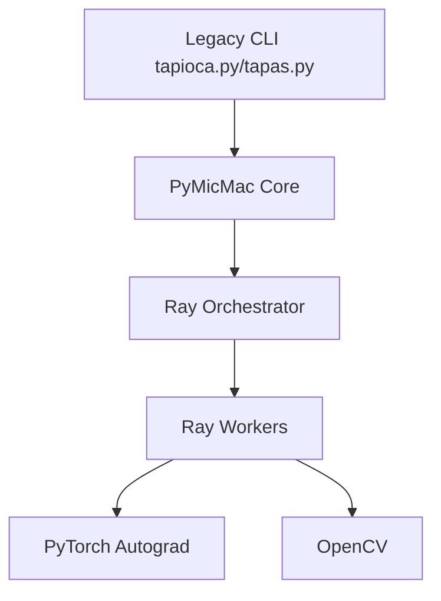
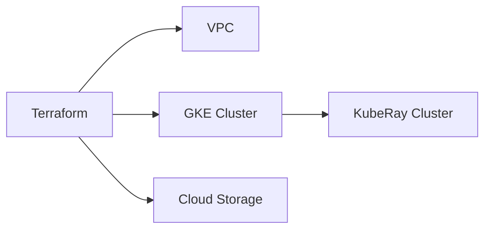

# PyMicMac Developer Guide

## Architecture

PyMicMac uses a decoupled architecture where core logic is in pure Python/PyTorch, and orchestration is handled by Ray.



## Quality Thresholds

- **Lizard**: Cyclomatic Complexity (CCN) < 10, Function Length < 80 lines.
- **Mypy**: Type checking.
- **Bandit**: Security scanning.
- **Ruff**: Linting.
- **Pytest**: Minimum 80% coverage.

## Running CI locally

```bash
./run-CI.sh
```

## GCP Infrastructure

Managed via Terraform in `install/gcp/`.


